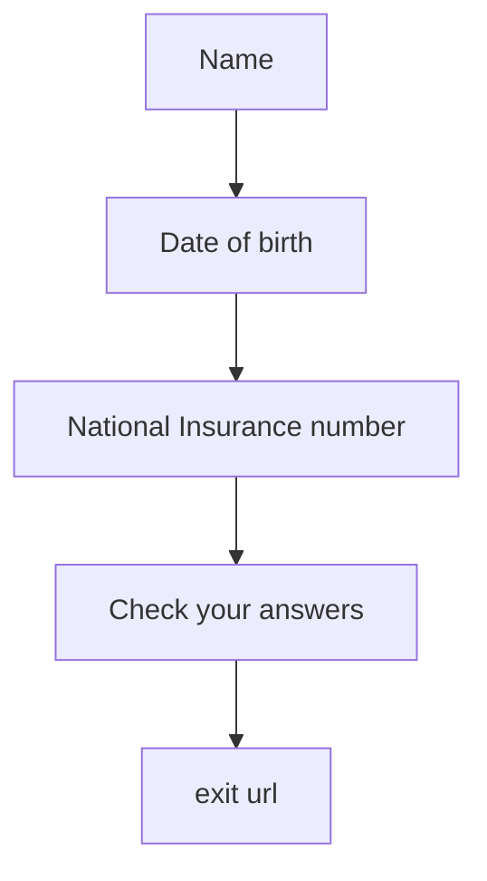

# govuk-prototype-kit-journey-plugin
Example of a small govuk prototype kit journey


## Getting started

1. npm install github:htmlandbacon/govuk-prototype-kit-journey-plugin

2. in your `app/routes.js` add the following

```
// import the routes
const journeyPluginExample = require("govuk-prototype-kit-journey-plugin");

// add the routes
journeyPluginExample(router);
```

3. Link to the journey section

```
{# example of a start button }
{{ 
    govukButton({
        text: "Start now",
        href: "/journey-plugin/start?journey_plugin_exit_url=/end-page",
        isStartButton: true
    })
}}
```

## Pages

- Name
- Date of birth
- National Insurance number
- Check your answers

## Flow

